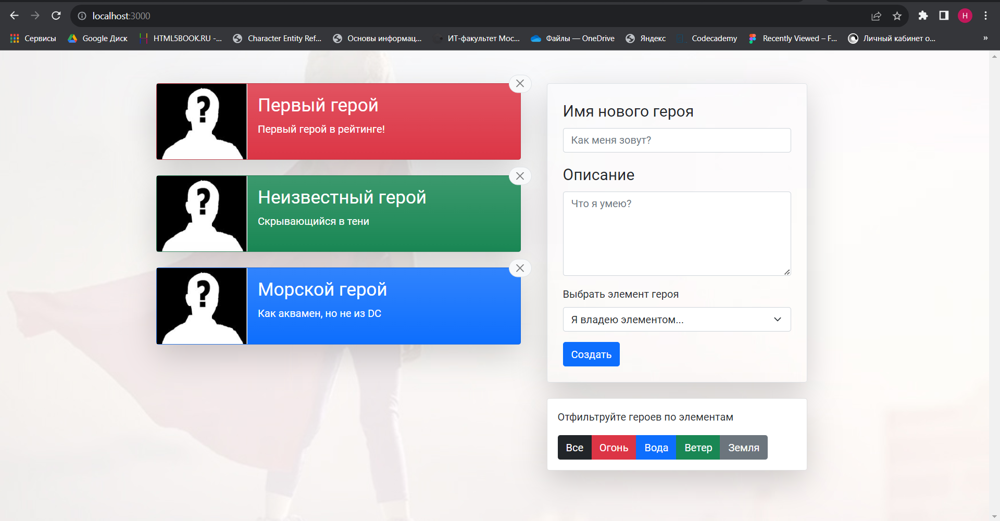

# Прототип административной панели

## Используемый стек технологий:
- ReactJS;
- Redux + RTK Query;
- Formik + Yup.

## Доступные сценарии
В каталоге проекта вы можете запустить:

### ``npm start``
Запускает приложение в режиме разработки и json server для раздачи данных.
Откройте http://localhost:3000 , чтобы просмотреть его в браузере.
